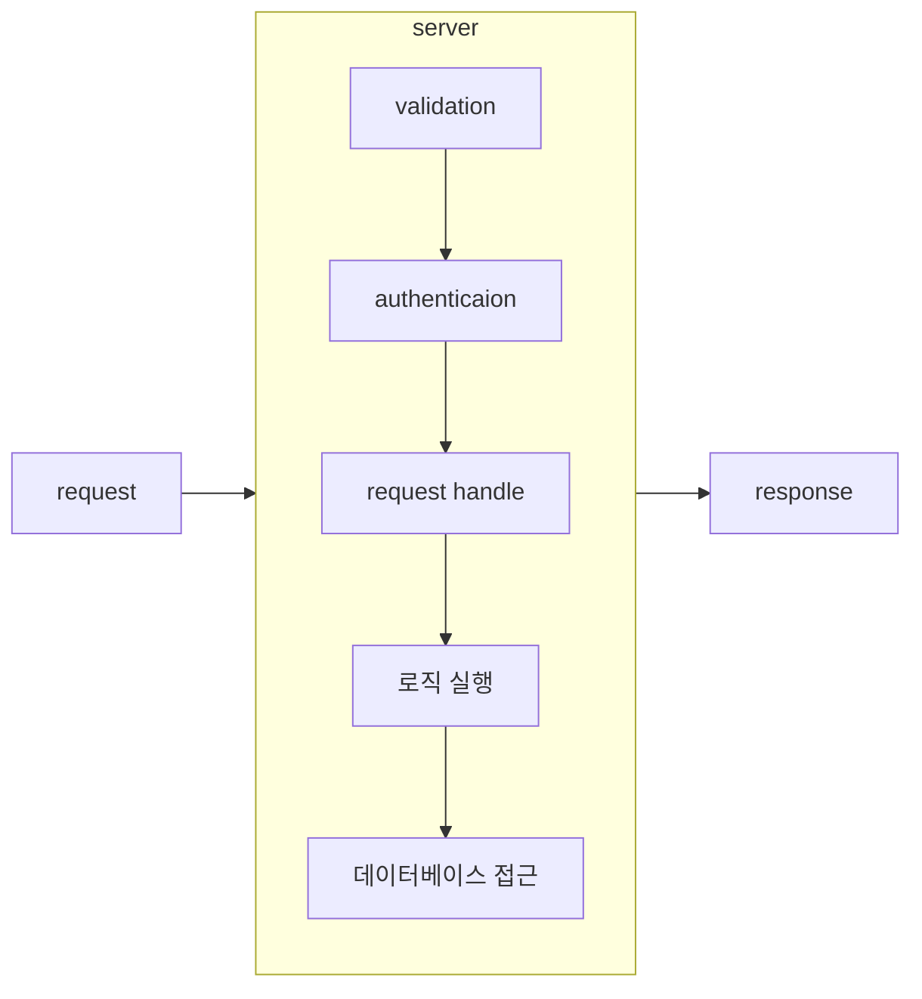
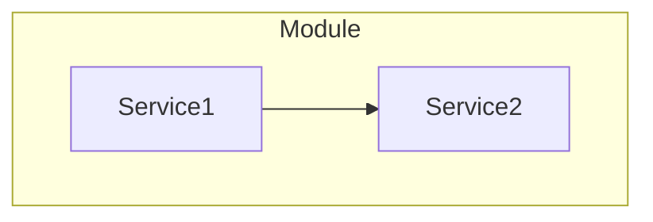
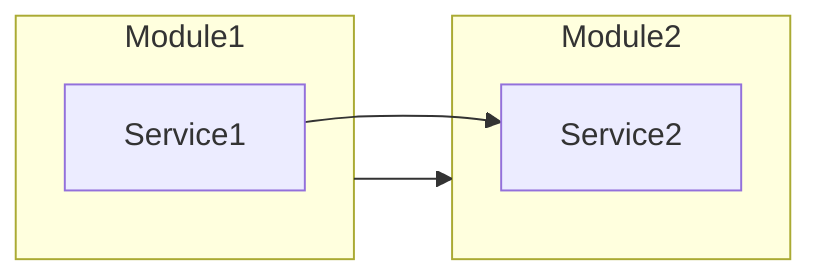
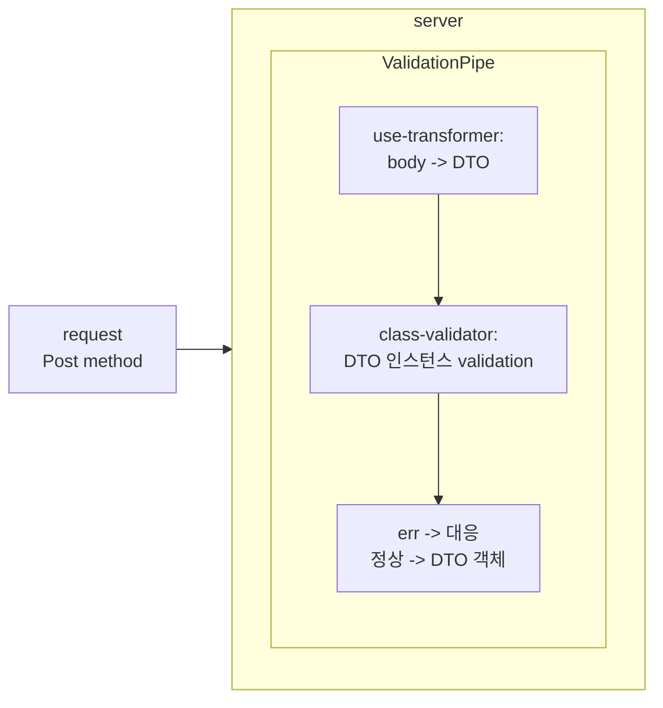
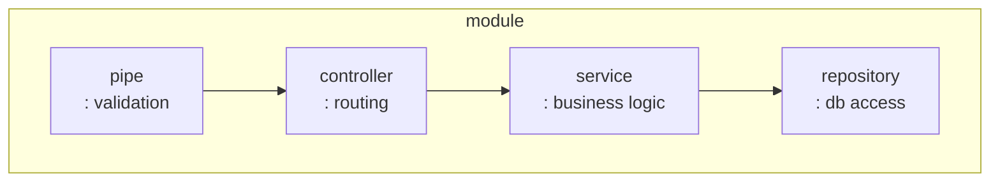
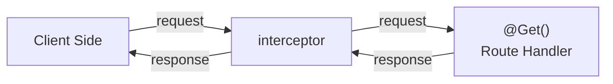
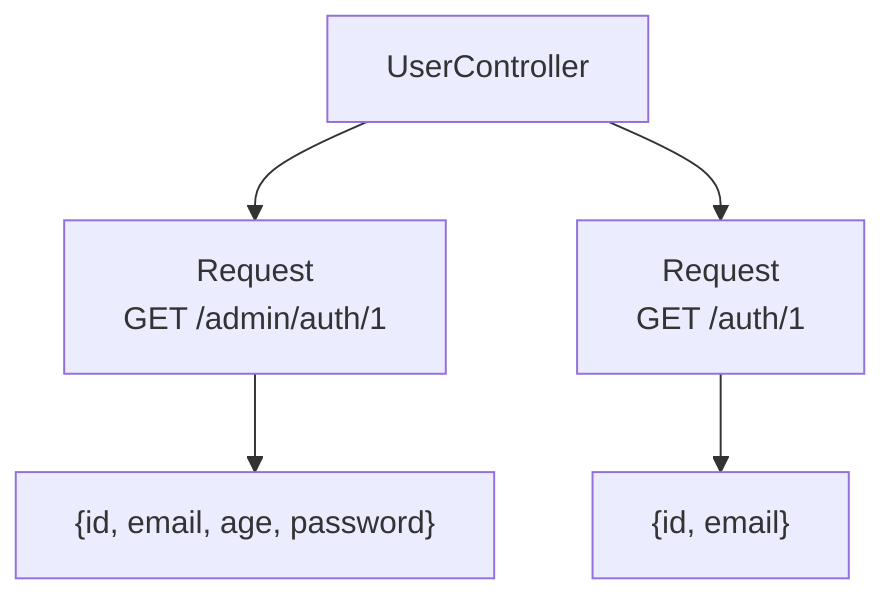

# nestjs 공부
공부에 참고한 내용들
- [공식 문서](https://nestjs.com/)
- [인터넷 강의](https://www.udemy.com/course/nestjs-the-complete-developers-guide/)
공식 문서와 인터넷 강의를 보면서 정리 + 클론 코딩한 내용을 기록합니다.
---
## 라이브러리들
nestjs는 여러개의 모듈 단위로 나뉘어 있으며, 사용자는 공식 홈페이지의 설명을 참고하여 어떤 라이브러리를 사용할지 선택할 수 있음.  
nest 자체는 서버의 역할 수행 못함. 일종의 메타 프레임워크로, 상용으로 사용되고 있는 express, fastify 등 웹서버 모듈을 포장하는 메타 프레임워크 에 해당.

- @nestjs/common: 클래스 정의, 데코레이터 함수 등 포함
- @nestjs/core: 실제 동작과 관련된 코드들 ex NestFactory
- @nestjs/platform-express: express 서버와 연결
- [rxjs](https://rxjs.dev/): nestjs에서 비동기 & 이벤트 처리를 위해 사용하는 라이브러리
- reflect-metadata: 데코레이터를 사용하기 위한 기능. 데코레이터 위해 다음 옵션 필요
    ```
    "experimentalDecorators": true,                   
    "emitDecoratorMetadata": true
    ```

## 서버 동작 과정


1. ```Pipe```: 들어오는 데이터 일부 또는 전체에 대해 유효성 검사
2. ```Guard```: 사용자의 인증 여부 및 권한 확인
3. ```Controller```: 요청을 대응되는 함수로 연결(라우팅)
4. ```Service```: 로직에 따라 서비스 처리
5. ```Repository```: 데이터베이스 접근

## nestjs의 구성 요소
- Controller: 들어오는 요청을 관리
- Services: 데이터 접근 및 로직 처리
- Module: 유사한 토픽을 가진 코드끼리 묶음
- Pipe: 들어오는 값에 대한 유효성 검사
- Filter: 요청을 다룰 때 발생하는 에러 처리
- Guard: 유저 인증(authentication) 수행
- Interceptor: request/response에 추가적인 로직 처리
- Repository: DB 다루는 모듈  

동작하기 위해 최소 1개의 모듈과 컨트롤러가 필요

```typescript
@Controller()
class AppController {
    @Get('/')
    getRouteRoute() {
        return 'hello, world!';
    }
}

@Module({
    controllers: [
        AppController
    ] // 현재 모듈과 관련된 모든 컨트롤러 명시
    //자동으로 인스턴스 생성해서 처리(Dependency Injection),
})
class AppModule {}

/**
 * @description 현재 모듈의 진입점
 */
async function bootstrap() {
    const app = await NestFactory.create<NestExpressApplication>(AppModule);
    // 실제 express와 관련된 기능을 사용할 것이 아니라면 타입은 명시하지 않아도 됨.
    app.listen(3000); // 포트 번호
}

bootstrap();
```
### convention
1. 파일 당 클래스는 하나만
2. 클래스는 자신의 타입을 이름에 포함  
   - ex: Controller -> ``App'Controller'``
3. 파일 이름은 name.type.ts 꼴  
   - ex: ``app.module.ts``
3. 클래스 이름과 파일 이름이 매칭되어야 함  
   - ex: AppController <-> app.controller.ts

---
## cli 사용법
nest cli을 사용하면 프로젝트에 필요한 초기 설정을 알아서 처리해줘서 편리함.
- 설치: ``npm install -g @nestjs/cli``
- 프로젝트 생성: ``nest new project_name``
- 내부 구성요소 생성
    - 모듈 생성: ``yarn nest generate module module_name``
    - 컨트롤러 생성: ``yarn nest generate controller folder_name/controller_name [--flat]``
        -  --flat: controllers 폴더를 추가로 만들지 않음

---
## Module
### 모듈 내부 DI

위 그래프에서 Service1, Service2는 동일한 모듈에 존재하며, s1은 s2를 사용한다고 하자.  
필요한 동작은 다음과 같다.
1. Service2에 @Injectable 데코레이터를 붙인다.
2. 공통 모듈 Module providers에 Service2를 추가한다.
3. Service1의 생성자에서 Service2을 인자로 받는다. 

### 모듈 사이의 DI

모듈 사이에서 DI를 수행하는 경우 다음 동작을 취한다.
1. Service2를 Module2의 providers 및 exports에 등록한다.
2. Module1에서 Module2를 imports에 등록한다.
3. Service1의 생성자에서 Service2를 인자로 받는다.
providers에 등록된 의존성들은 외부에 공개되지 않는다. 따라서 다른 모듈에서 사용하기 위해서는 exports 및 imports을 이용하여 명시적으로 등록해야 한다.  
- exports: 외부로 내보낼 의존성을 등록한다. DI token이다.
- imports: 외부에서 가져올 모듈을 등록한다.
## Controller

### 사용되는 데코레이터 목록
``@nestjs/common``에 정의되어 있다.
- 메서드 데코레이터( HTTP 메서드 시리즈 + )
    - ``@Get('route/:id')``: urlparam도 함께 정의할 수 있음.
    - ``@Post('route')``
    - ``@Header(key, value)``: 응답에 대해 헤더 지정
    - 이외 HTTP 메서드 이름을 가진 메서드들
    - ``@HttpCode(200)``: http status code
    - ``@Redirect(path, code)``: res.redirect()에 대응.   
    함수 내부에서 동적으로 동작할 수도 있음.   
    ``return {url: ~, statusCode: ~};`` 형식으로 반환
- 변수 데코레이터(HTTP 패킷 정보 관련)
    - ``@Headers(key?:string)``: HTTP 헤더 정보
    - ``@Body(key?:string)``: HTTP body 정보.   
    사용하기 전에 validation이 필요하다. pipe을 이용하여 처리한다.
    - ``@Param('name')``: url param 정보. /``:name``에 대응.   
    param 자체는 string으로 들어온다. 
    - ``@Query('query')``: url query 정보. /addr``?query=something`` 에 대응
    - ``@Ip()``: 사용자의 ip (req.ip)
    - ``@HostParams()``: 사용자의 호스트 정보(req.hosts)
- express 미들웨어 기능에 대응되는 요소
    - ``@Req()``,``@Request()``: Request 객체 -> req: Express.Request
    - ``@Res()``,``@Response()``: Response 객체 -> -> req: Express.Response   
    response 객체는 구체적인 환경을 참조하므로 권장하는 방법은 아님. 해당 객체 없이 privitive type은 따로 직렬화 X, **배열 및 객체** 같은 경우는 **자동으로 JSON** 변환.   
    응답은 기본 값 200, POST 201. 필요에 따라 @HttpCode() 데코레이터로 변경 가능.
    - ``@Next()``: Next 기능 -> next: Express.Next
---
## Pipe
파이프는 다음과 같은 기능 수행
- transformation: 값을 원하는 형태로 변경.   
ex: ``@Param('id', ParseIntPipe) id: number``
- validation: 들어온 값에 대한 검증 수행. 일반적으로 default ValidationPipe을 등록하여 사용.
    ```typescript
    // 방법 1. app.useGlobalPipes에 등록하기
    const app = await NestFactory.create(MessagesModule);
    app.useGlobalPipes(new ValidationPipe());
    await app.listen(3000);
    // 방법 2. 모듈 수준에서 의존성 주입
    import { Module } from '@nestjs/common';
    import { APP_PIPE } from '@nestjs/core';

    @Module({
    providers: [
        {
        provide: APP_PIPE,
        useClass: ValidationPipe,
        },
    ],
    })
    export class AppModule {}
    ```
    각 경로에 대해 파이프를 사용하고 싶은 경우 ``@usePipes()`` 데코레이터 이용.   
    또는 다른 데코레이터에 넣어서 사용할 수도 있음   
    ex: ``@Param('id',new DefaultValuePipe(0), ParseIntPipe) id: number``
### ValidationPipeOptions
[공식 문서](https://docs.nestjs.com/techniques/validation#using-the-built-in-validationpipe). class-validator의 ValidatorOptions에서 제공하는 옵션을 모두 사용할 수 있다고 함.
- whitelist: DTO에 정의된 프로퍼티가 아니라면 제거. 보안상의 문제(admin: true) 회피
    - ex: DTO{email, password} 일 때 외부에서 DTO{name, email, password} 전송하면 name은 제거
    - header
        ```http
        POST /auth/signup HTTP/1.1
        Host: localhost:3000
        Content-Type: application/json

        {
            "email": "test123@gmail.com",
            "password": "test",
            "stuff": 123
        }
        ```
    - result
        ```http
        HTTP/1.1 201 Created
        X-Powered-By: Express
        Content-Type: application/json; charset=utf-8
        Content-Length: 47
        ETag: W/"2f-Ur5InhBkxpnHiG7hdL2twNkYu+8"
        Date: Mon, 14 Aug 2023 14:39:12 GMT
        Connection: close

        {
            "email": "test123@gmail.com",
            "password": "test"
        }
        ```
### default validation pipe
built-in validation pipe은 다음 라이브러리들을 요구함.
- class-validator: 데코레이터 기반으로 클래스의 유효성을 검증
- class-transformer: 객체를 기반으로 클래스를 생성   

두 라이브러리를 이용하여 다음과 같은 동작을 수행
1. 들어오는 값을 class-transformer을 이용하여 클래스로 변환
2. 변환된 클래스에 대해 class-validator을 이용하여 validation 수행
```typescript
import { PipeTransform, Injectable, ArgumentMetadata, BadRequestException } from '@nestjs/common';
import { validate } from 'class-validator';
import { plainToInstance } from 'class-transformer';

@Injectable()
export class ValidationPipe implements PipeTransform<any> {
    
    // transform 과정에서 비동기 동작 있을 수 있으므로 기본 async
    // custom pipe은 반드시 PipeTransform 구현해야
    async transform(value: any, { metatype }: ArgumentMetadata) {
        if (!metatype || !this.toValidate(metatype)) {
        return value; // validation 대상인지 체크
        }
        const object = plainToInstance(metatype, value); // 클래스 변환
        const errors = await validate(object); // 변환한 클래스 검사
        if (errors.length > 0) { // 검사 실패하면 에러 반환
        throw new BadRequestException('Validation failed');
        }
        return value; // 성공하면 값 반환
    }

    private toValidate(metatype: Function): boolean {
        const types: Function[] = [String, Boolean, Number, Array, Object];
        return !types.includes(metatype);  
    }
}

// ArgumentMetadata: 메타데이터에 대한 인터페이스
export interface ArgumentMetadata {
  type: 'body' | 'query' | 'param' | 'custom'; // body argument 의미
  metatype?: Type<unknown>;
  data?: string; // 데코레이터에 넣은 문자열 ex) @Body('id') -> data: id
}
```
### DefaultValuePipe
Parse__Pipe 파이프들은 값을 변경하는데 사용하기 좋지만, 들어온 파라미터가 null/undefined인 경우 에러를 발생시킨다. 쿼리 같은 경우 존재하지 않으면 기본 값으로 지정하고 싶은 경우가 있는데, 이럴 때 DefaultValuePipe을 이용하여 기본 값을 지정할 수 있다.
```typescript
@Get('/:id')
getMessage(
    @Param('id', ParseIntPipe) id: number, // 없으면 에러 발생해야 함
    @Query('validate', 
        new DefaultValuePipe(false), // 없으면 기본 값 false로 삽입
        ParseBoolPipe) validate: boolean = false) {
    return `hello, id: ${id}, query: ${validate}`;
}
```

### 사용 예시
```typescript
// 01. dto 선언
import {IsString} from 'class-validator';

export class CreateMessageDTO {
    @IsString({
        message:"content must be string"
    })
    content: string;
}
// 02. app.useGlobalPipes에 ValidationPipe 등록
app.useGlobalPipes(new ValidationPipe());
// 03. controller의 @Body, @Param, @Query 등
// 데코레이터가 적용된 파라미터의 타입을 DTO로 설정
@Post()
createMessage(@Body() dto: CreateMessageDTO) {
    return `content is : ${dto.content}`;
}
// 04. 해당 메서드 실행될 때 자동적으로 Body 정보를 dto로 validation.
```
### DTO(Data Transfer Object)
request body가 가져야 할 속성을 정의하는 클래스. Class validator의 데코레이터와 함께 사용되어 들어온 값을 자동으로 파싱 및 validation 할 때 사용될 수 있다.  
```typescript
import {IsString} from 'class-validator';

export class CreateMessageDTO {
    @IsString({
        message:"content must be string"
    })
    content: string;
}
```
dto는 데이터 전송에 사용되는 클래스로, 별개의 기능 없이 프로퍼티 정의만 가지는 경우가 많다. 여러 프레임워크에서 사용되는 개념이다.

1. request body를 class-transformer을 이용하여 DTO로 인스턴스화
2. class-validator을 이용하여 값을 유효성 검증
3. 정상적인 경우 DTO를 이용하여 검사, 아니면 에러 메시지로 응답

코드가 자바스크립트로 변환됨에도 불구하고 DTO 관련 정보가 남는 점이 특이. 일반적인 코드에서는 자바스크립트로 컴파일 될 때 타입 정보가 손실되는 것이 정상이나, 데코레이터를 이용하면 타입 정보 남기기 가능.
```javascript
__decorate([
    (0, common_1.Get)(),
    __metadata("design:type", Function),
    __metadata("design:paramtypes", []),
    __metadata("design:returntype", void 0)
], MessagesController.prototype, "listMessages", null);
```
컴파일 과정에서 ```__decorate```나 ```__metadata```가 추가됨.  
중요한 옵션은 [emitDecoratorMetadata](https://www.typescriptlang.org/tsconfig#emitDecoratorMetadata)로, 위 언급한 ```__decorate``` 및 ```__metadata```를 컴파일 과정에서 추가.

---
## Provider

nestjs 공식 홈페이지 기준, Service / Repository는 provider에 속한다. provider은 @Injectable 데코레이터를 적용하는 클래스들 중 하나로, DI 기반으로 비즈니스/DB 등 자신에게 부여된 기능을 제공한다.
### Services
비즈니스 로직을 정의한 클래스
### Repositories
저장소(DB / storage-related) 관련 로직을 정의한 클래스.  
보통 ORM과 엮어서 db 로직 작성.

### Service vs Repository
기능적 차이에 따라 구분하는 것일 뿐, 다른 클래스에서 의존성 주입을 통해 이용하는 방식은 동일하다. 위 언급한대로 @Injectable 데코레이터가 있다.

### Dependency Injection
```typescript
class MessageService {
    private msr: MessageRepository;

    constructor() {
        this.mss = new MessageRepository();
    }
}

```
각 클래스에서 직접 의존성을 지닌 타 클래스를 생성하고 관리하게 만들면 의존 역전의 원칙(Dependency Inversion) 원칙을 위배, 구체적인 클래스들끼리 연관되어 결합도가 높아짐. 또한 각각의 인스턴스가 필요한 상황이 아닌데 중복해서 만들게 되서 필요 없는 중복 생성이 발생.
```typescript
class MessageService {    
    constructor(private mss: MessageRepository) {}
}
```
서비스 인스턴스를 내부에서 직접 생성하는 대신 외부에서 받아오도록 구성하면 nestjs가 인스턴스를 관리, 의존성을 주입해줌(Dependency Injection). 하지만, 이 방식만으로는 Dependency Inversion을 만족하지 않음.   MessagesService에 대한 인터페이스를 분리, 추가 설정을 통해 DI 달성 가능.
```typescript
// in message.service.ts file
interface Repository {
    // functions...
}

class MessageService {
    constructor(@Inject('MSG_REPO') private mss: Repository) {}
}
// in module.ts file
@Module({
  controllers: [AppController, MessagesController],
  providers: [AppService, MessagesService, {
    provide: 'MSG_REPO',
    useClass: MessageRepository
  }]
});
```
Module에서 Inject할 대상을 useValue/Class/Factory를 통해 설정, provide 옵션의 값과 @Inject의 값을 동일하게 지정.
### DI Container
의존성 주입을 이용하는 경우 하나의 동작을 위해 수많은 코드가 연쇄적으로 필요하게 됨. 예를 들어 DB에 접근하는 서비스를 라우팅하는 컨트롤러를 구성하려면 Controller - Service - Repository로 3개의 코드 베이스가 필요함.
```typescript
const repo = new Repository(options);
const service = new Service(repo);
const controller = new Controller(service);
const module = new Module(controller); // 직접 주입하는 경우
```
컨트롤러 / 서비스 등이 추가될 때마다 이런 자질구레한 코드를 추가하는 것은 너무 불편. 개발자가 각 컴포넌트들을 직접 생성 / 관리 / 주입하는 노동이 요구되기 때문.   
이런 의존성을 알아서 관리하고 주입해주는 시스템이 필요한데, 이런 시스템들을 DI Container/Injector이라고 부른다.   
### 동작 방식
1. DI Container 시스템에 클래스 목록을 등록
2. 시스템이 클래스의 의존성 목록을 분석
3. 시스템은 클래스들을 생성 및 관리(기본 설정 싱글톤)
4. 사용자가 요청하면 관련된 객체를 재사용하며 서비스 제공  

```@injectable()``` 데코레이터를 적용한 클래스를 ```@Module()``` 데코레이터의 속성 중 하나인 providers 배열에 등록하면 DI의 대상이 된다.  
```typescript
// 모듈에 등록 (app.module.ts)
@Module({
  controllers: [AppController, MessagesController],
  providers: [
    AppService,
    MessagesService,
    {
      provide: 'MSG_REPO',
      useClass: MessageRepository
    }
  ]
})

// MessageService에 삽입
interface Repository {
    findOne(id:string): Promise<any>;
    findAll(): Promise<any>;
    create(content:string): Promise<void>;
}

@Injectable()
export class MessagesService {
    constructor(
        @Inject('MSG_REPO') private messageRepo: Repository
    ) { // 삽입한 코드
        console.log("Message Service Created")
    }
}
```

### provider
providers에는 value, class, factory 형태로 의존성이 등록될 수 있으며, 자세한 사항은 [공식 문서](https://docs.nestjs.com/fundamentals/custom-providers) 참고.  
### standard provider
nest에서 기본적으로 제공하는 공급자는 클래스 공급자의 형태로, providers 배열에 클래스 생성자를 제공한다. 기본 방식은 클래스 생성자의 provide, useClass 속성에 주입하고 싶은 클래스를 정의하는 형태와 동일하다.
```typescript
@Module({
  controllers: [MessagesController],
  providers: [
    MessagesService
  ]
})
// 아래 코드와 동일하다
@Module({
  controllers: [MessagesController],
  providers: [
    {
        provide: MessagesService,
        useClass: MessagesService
    }
  ]
})
```
### DI token
providers 배열에 의존성 리스트를 정의할 때 custom provider의 경우 use~ 속성과 ```provide``` 속성을 정의한다. 이때 ```provide```에 해당하는 값을 DI token이라고 한다.  
토큰은 각 의존성을 구분하는데 사용되는 값으로, 공식 문서에서는 토큰으로 4가지를 사용할 수 있다고 한다.
1. 클래스 이름 (default)
2. 문자열
3. Symbol
4. typescript 열거형
표준에서 제공하는 클래스 이름을 제외하면 의존성 주입 단계에서 ```@Inject()``` 데코레이터를 이용해야 한다.
```typescript
// 1. 표준 제공하는 클래스 이름 토큰의 경우
// MessageRepository로 접근 가능
private messageRepo: MessageRepository
// 2. custom provider의 경우
// 토큰을 이용하여 접근 가능
@Inject('MSG_REPO') private messageRepo: Repository
```
### custom provider
공급자는 3 + 1개의 종류로 나뉜다.

1. value provider (useValue)
2. class provider (useClass)
3. factory provider (useFactory)
4. alias provider (useExisting)

### value Provider
상수 값을 주입할 때 사용한다.  
타입스크립트의 [구조적 타이핑](https://www.typescriptlang.org/ko/docs/handbook/type-compatibility.html)에 의해 두 객체가 동일한 멤버를 가지고 있다면 해당 객체들은 호환되어 서로에게 할당할 수 있다고 한다. 이런 특성을 이용하여 실제 클래스에 대한 mockup 객체를 정의할 때 사용할 수 있다.  
```typescript
const mockupMessagesService = {
  findOne: async (id: string) => `id = ${id}`,
  findAll: async () => ['1','2','3'],
  create: async () => {console.log("create")}
};

@Module({
  controllers: [AppController, MessagesController],
  providers: [
    AppService,
    {
      provide: MessagesService,
      useValue: mockupMessagesService
    },
    // MessagesService,
    {
      provide: 'MSG_REPO',
      useClass: MessageRepository
    }
  ]
})
```
위 코드를 입력하여 실행해본 결과 실제로 동작한다. (vscode Rest Client 확장)
```http
### get message
GET /messages/28 HTTP/1.1
Host: localhost:3000
Accept: application/json
```

```
// 출력된 결과

HTTP/1.1 200 OK
X-Powered-By: Express
Content-Type: text/html; charset=utf-8
Content-Length: 7
ETag: W/"7-2YcGs8Prm2a/9iVqTMK23Q15Ank"
Date: Mon, 24 Jul 2023 07:10:12 GMT
Connection: close

id = 28
```
### class provider
useClass를 통해 클래스를 제공하는 공급자이다. 공식 문서에서는 환경에 따라 조건부로 제공하는 코드를 제시하고 있다.
```typescript
provide: ConfigService,
useClass:
process.env.NODE_ENV === 'development'
    ? DevelopmentConfigService
    : ProductionConfigService,
```


## Exception filter
요청에 대한 예외 처리를 잡는 필터. 컨트롤러 등에서 throw 구문을 통해 **HttpException**(nest 제공)또는 해당 클래스를 상속한 에러를 던지면 기본 예외 필터에서 잡아서 처리해줌.
### 사용 방식
```typescript
@Get(':id') // exception filter 사용
async getSpecificMessage(@Param('id') id: string) {
    const target =  await this.mss.findOne(id);
    if(target) return target;
    else throw new NotFoundException(`no message [id: ${id}]`);
}
```
### 에러 상속
```typescript
export class ForbiddenException extends HttpException {
  constructor() {
    super('Forbidden', HttpStatus.FORBIDDEN);
  }
}
```
### 필터 바인딩
```@UseFilters``` 데코레이터를 이용하여 컨트롤러/경로 단위로 필터를 지정할 수도 있음.  
```typescript
@Post()
@UseFilters(new HttpExceptionFilter())
async create(@Body() dto: CreateUserDto) {
  throw new NotFoundException();
}
```
### 예시
```typescript
async remove(id: number) {
const user = await this.userRepo.findOneBy({ id });
if (!user) {
    throw new NotFoundException('user not found');
}
return this.userRepo.remove(user);
}
```
### Exception 사용 시 고려할 점
- 위에서 언급한 Exception은 HTTP 프로토콜을 사용한다는 가정 하에 동작한다. 만약 WebSocket, gRPC 같은 별개의 프로토콜을 도입하는 경우 HTTPException을 캐치하지 못한다. 만약 하나의 프로젝트에서 여러 프로토콜을 사용한다면 useFilter 데코레이터 및 해당 프로토콜에 대해 제공되는 필터 / 에러를 이용하자.
- websocket: https://docs.nestjs.com/websockets/exception-filters
- grpc: https://docs.nestjs.com/microservices/exception-filters
# Interceptor
메서드 / 함수 / request 등, 실행 전·후 단계에서 흐름을 가로채서 데이터를 조작.


원래 흐름대로면 사용자 요청이 바로 Route Handler에 전달되어야 하나, 중간에 Interceptor가 흐름을 가로채서 데이터를 수정하거나, 추가적인 기능을 수행할 수 있다.
## 사용하는 경우
- 메서드 실행 전·후 추가 로직 바인딩
- 함수 실행 결과를 변환
- 함수가 던진 예외를 변환
- 기본적인 함수의 기능을 확장
- 특정 조건에서 함수를 완전히 오버라이딩 가능(캐싱 등 목적)

## 사용하기
NestInterceptor을 구현하며, ``@Injectable()`` 데코레이터를 요구한다. RxJs 지식 필요.
```typescript
// nestjs 공식문서: https://docs.nestjs.com/interceptors#stream-overriding
import { Injectable, NestInterceptor, ExecutionContext, CallHandler } from '@nestjs/common';
import { Observable, of } from 'rxjs';

@Injectable()
export class CacheInterceptor implements NestInterceptor {
  intercept(context: ExecutionContext, next: CallHandler): Observable<any> {
    const isCached = true;
    if (isCached) {
      return of([]);
    }
    return next.handle();
  }
}
```
인터셉터 구현 후 ``@UseInterceptors`` 데코레이터를 이용하여 대상에게 바인딩한다.
## 예시: 중요 정보 지워 전달하기
유저 정보와 관련된 서비스가 존재한다. 유저 정보에는 id, email, password 등이 존재하나, id 및 password 같은 중요한 정보들은 노출시키고 싶지 않다. [공식 문서](https://docs.nestjs.com/techniques/serialization)
```typescript
// in user.entity.ts
import { Exclude } from 'class-transformer';

@Entity()
export class User {
  @Exclude() // Exclude 선언
  id: number;
  email: string;

  @Exclude()
  password: string;
}

// in controller 
import {
//...
  UseInterceptors,
  ClassSerializerInterceptor,
} from '@nestjs/common';
//...
@UseInterceptors(ClassSerializerInterceptor)
@Get()
async findAllUsers(@Query('email') email: string) {
return this.usersService.find(email);
}
```
- 노출하지 않을 속성에 ``@Exclude()`` 붙여 명시한다. 이 데코레이터를 붙이면 class-transformer이 클래스를 객체로 변환할 때 대상 속성을 제외한다.
- 대상 컨트롤러 / 루트에서 ``@UseInterceptor(ClassSerializerInterceptor)``
### 문제점 및 대안

동일한 메서드가 요청 경로에 따라 다른 결과를 반환해야 한다면 문제가 발생한다. 현재 방식은 객체 변환 과정에서 제외할 요소를 하드코딩 해서 경우에 따라 다른 속성을 포함한 객체를 반환하기는 어렵다.

대안은 다음과 같다.

1. 서비스 수준에서 특정 속성을 반환하는 메서드를 여러개 만든다.
    - typeorm의 반환 단계에서 ``select`` 옵션을 사용하면 쉬움. 다만 typescript 기준 select 후 선택 안한 속성도 표현됨.
    - ex: User {id, email}만 선택했더라도 타입 자체는 User {id, email, age, password}로 표현되서 에러 발생 쉽다.(반환형이 User이니까)
2. 각 route에서 반환할 DTO를 정의하고 custom interceptor 사용해서 처리
    - 엔티티에 직렬화 관련 논리를 포함하지 않아도 됨.
    - DTO는 request, response 과정에 모두 사용될 수 있음.
```typescript
@Injectable()
export class SerializeInterceptor implements NestInterceptor {
  intercept(context: ExecutionContext, next: CallHandler): Observable<any> {
    // run something before a request is handled
    console.log('im running before handler', context);

    return next.handle().pipe(
      map((data: any) => {
        // run something before response is sent out
        console.log('im running after handler', data);
        return data;
      }),
    );
  }
}
```
Interceptor은 request 이전, response 이후(유저 전달 이전)를 가로챌 수 있으며, 둘은 로직 처리 위치가 다름.
- request 이전: return 문 전에 작성
- response 이후: return문의 pipe 내부에 명시
## SerializeInterceptor
Dto 기반 직렬화 기능을 하는 범용 인터셉터로, 현재 2가지 방식으로 구현함
1. Dto를 Interceptor에게 직접 전달(serialize)
2. setMetaData로 Dto 설정 후 reflector 사용하여 Interceptor에게 전달(serialize1)

### DTO 인자 전달
```typescript
export function SerializeDTO(dto: ClassType) {
  return UseInterceptors(new SerializeInterceptor(dto));
}

@Injectable()
export class SerializeInterceptor implements NestInterceptor {
  constructor(private dto: ClassType) {}
  intercept(context: ExecutionContext, next: CallHandler): Observable<any> {
    // // run something before a request is handled
    // console.log('im running before handler', context);

    return next.handle().pipe(
      map((data: any) => {
        // // run something before response is sent out
        // console.log('im running after handler', data);
        // return data;
        return plainToClass(this.dto, data, {
          excludeExtraneousValues: true, // 이외의 값은 무시
        });
      }),
    );
  }
}
```
인자로 전달 된 dto를 class-transformer과 조합하여 대응되는 DTO 객체 생성
### metadata 활용
```typescript
// dto.decorator.ts
export function UseDto<T extends ClassType>(dto: T) {
  return SetMetadata('dto', dto);
}

// serializable1.interceptor.ts
export function SerializeDTO1(DTO: ClassType) {
  return applyDecorators(UseDto(DTO), UseInterceptors(SerializeInterceptor1));
}

@Injectable()
export class SerializeInterceptor1 implements NestInterceptor {
  constructor(private reflector: Reflector) {}
  intercept(context: ExecutionContext, next: CallHandler): Observable<any> {
    const Dto = this.reflector.getAllAndOverride<ClassType>('dto', [
      context.getHandler(),
      context.getClass(),
    ]);
    // https://docs.nestjs.com/fundamentals/execution-context#reflection-and-metadata
    // // run something before a request is handled
    // console.log('im running before handler', context);

    return next.handle().pipe(
      map((data: any) => {
        // // run something before response is sent out
        // console.log('im running after handler', data);
        // return data;
        return plainToClass(Dto, data, {
          excludeExtraneousValues: true, // 이외의 값은 무시
        });
      }),
    );
  }
}
```
setMetadata로 메타데이터를 설정하는 UseDto 작성. Interceptor 내부에서는 Reflector 클래스를 이용하여 현재 컨텍스트의 핸들러(route 메서드) 및 클래스를 참조하여 메타데이터를 추출. 추출한 DTO를 사용하도록 구현됨.

이 경우 2개의 데코레이터가 항상 함께 사용되므로, applyDecorators를 사용하여 하나의 데코레이터 형태로 묶었음.

[공식 문서](https://docs.nestjs.com/fundamentals/execution-context) 참고

# typeorm
https://typeorm.io/

데코레이터 기반 ORM 중 하나로, sequelize와 더불어 nestjs가 간단한 설정을 지원하고 있다.  
nestjs에서 지원하는 ``@nestjs/typeorm``모듈을 사용하면 알아서 repository을 생성하고 관리해주므로, 좀 더 편리하게 사용 가능하다
## 세팅
- 설치
    ```shell
    npm install typeorm @nestjs/typeorm
    ```
- 등록: app.module.ts에서 Typeorm으로 DB 연결(``TypeormModule.forRoot(config)``)
    ```typescript
    // app.module.ts
    import { TypeOrmModule } from '@nestjs/typeorm';
    import { typeormDevConfig } from 'config/typeorm/dev.config';
    @Module({
    imports: [
        //...
        TypeOrmModule.forRoot(typeormDevConfig),
    ],
    controllers: [AppController],
    providers: [AppService],
    })
    export class AppModule {}

    // config/typeorm/dev.config.ts
    import type { TypeOrmModuleOptions } from '@nestjs/typeorm';
    import { Report } from 'src/reports/report.entity';
    import { User } from 'src/users/user.entity';

    export const typeormDevConfig: TypeOrmModuleOptions = {
    type: 'sqlite',
    database: 'db.sqlite',
    entities: [User, Report], // 존재하는 엔티티 목록을 모두 등록
    synchronize: true,
    };
    ```
## 엔티티 생성
1. 엔티티 파일 생성해서 엔티티가 가진 프로퍼티 정의
    ```typescript
    import { IsNumber, IsEmail, IsString } from 'class-validator';
    import { Entity, Column, PrimaryGeneratedColumn } from 'typeorm';

    @Entity()
    export class User {
    @PrimaryGeneratedColumn()
    @IsNumber()
    id: number;

    @Column()
    @IsEmail()
    email: string;

    @Column()
    @IsString()
    password: string;
    }
    ```
2. 엔티티를 부모 모듈과 연결.(``TypeormModule.forRoot(config)``: dynamic 모듈 -> 레포지토리)
    ```typescript
    import { Module } from '@nestjs/common';
    import { TypeOrmModule } from '@nestjs/typeorm';

    import { UsersService } from './users.service';
    import { UsersController } from './users.controller';
    import { User } from './user.entity';

    @Module({
    // dynamic module 형태로 사용할 수 있게 구성
    imports: [TypeOrmModule.forFeature([User])], 
    providers: [UsersService],
    controllers: [UsersController],
    })
    export class UsersModule {}
    ```
3. 엔티티를 루트(app 모듈)와 연결 (entites에 프로젝트 내 엔티티 모두 포함)
    ```typescript
    export const typeormDevConfig: TypeOrmModuleOptions = {
    //...
    entities: [User, Report], // 존재하는 엔티티 목록을 모두 등록
    };
    ```
레포지토리를 사용하는 위치에는 다음과 같이 의존성을 주입한다.
```typescript
import { Injectable } from '@nestjs/common';
import { Repository } from 'typeorm';
import { InjectRepository } from '@nestjs/typeorm';
import { User } from './user.entity';

@Injectable()
export class UsersService {
  constructor(@InjectRepository(User) private userRepo: Repository<User>) {}
}
```
- ``@InjectRepository(Entity)`` 데코레이터 적용.
    - reflect-metadata는 제네릭 정보를 해석하지 못함. 대신 데코레이터를 추가해서 의존성에 주입할 엔티티가 무엇인지 명시한 것
- ``Repository<Entity>`` 타입으로 받음. typeorm의 dataSource.getRepository(Entity)을 수행할 것으로 예상
## repository api
[공식 문서](https://typeorm.io/repository-api)
typeorm은 하나의 동작에 대해 다양한 방법을 제공. 필요에 따라 읽어봐야 함.
### Create & Save
- ``create({...properties})``: 엔티티 인스턴스를 생성
- ``save({...properties})``: 엔티티 인스턴스를 저장
### Create 후 Save 해야 하는 이유
- ``save``에 인자를 넘겨서 바로 DB에 저장할 수 있지만, validation 로직을 처리하기 위해서는 인스턴스를 생성하여 class-validator의 validation 함수를 실행해야 한다.
- hook 함수들(beforeInsert 등)은 엔티티 클래스 본문에 정의되어 있다. ``save``에 객체를 넘겨 바로 DB에 저장하는 경우 이러한 hook들이 실행되지 않는다. 이런 버그는 매우 감지하기 어려우므로, ``save`` 함수를 사용한다면 엔티티 인스턴스를 먼저 생성한 후 저장하는 것이 좋다.

### save vs update / insert
- ``save``: 엔티티 인스턴스를 저장. hook 함수 실행됨. 트랜잭션 기반 즉시 삽입
- ``update, insert, upsert``: 객체를 기반으로 바로 생성 또는 갱신. hook X
### remove vs delete
- ``remove``: 엔티티 인스턴스 기반 삭제. hook 함수 실행됨. 트랜잭션 기반 즉시 삽입
- ``delete``: 조건 / Id 등을 통해 삭제. hook 함수 실행 안됨

``save``, ``remove``는 데이터를 처리하기 위해 DB로부터 먼저 데이터 fetch 필요
1. find 쿼리로 DB에서 인스턴스 찾기
2. 업데이트 적용
3. save로 DB 반영

hook이 필요하지 않다면 save / remove 사용은 손해