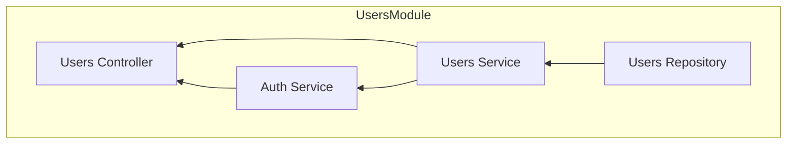

# 자동차 견적 api

1. ID / 비밀번호로 가입
2. 연식, 모델, 마일리지 등 기반으로 검사 가능
3. 유저는 자기 차가 어떻게 팔렸는지 리포트 볼 수 있음
4. 관리자는 기록된 판매를 검토, 승인

## 구현해야 하는 동작 목록
동작 | 메서드 | 경로
|-|-|-|
|로그인 | POST  | /auth/signin |
|ID 생성 | POST | /auth/signup |
|레포트 읽기 | GET | /reports |
|레포트 작성 | POST | /reports |
|레포트 수정 | POST | /reports/:id |

### user module
메서드/경로 | body | 메서드 | 설명 |
|-|-|-|-|
| POST /auth/signup | {email, password} | createUser | 유저 생성 |
| GET /auth/:id | x | findUser | id 기반 유저 찾기 |
| GET /auth?email=... | x | findAllUsers | 주어진 email 기반 모든 유저 찾기 |
| PATCH /auth/:id | {email, password} | updateUser | 주어진 id로 유저 업데이트 | 
| DELETE /auth/:id | x | removeUser | 주어진 id의 유저 삭제 |

### Authentication
1. 유저 로그인 요청 (POST /api/signup {id, password})
2. 이메일 존재 검사
3. 패스워드 암호화
4. 새로운 레코드로 저장
5. 쿠키에 유저 Id 담아 반환
6. 사용자가 이후 요청
7. 사용자 요청에 쿠키 담아 처리
8. 쿠키 내 데이터 유효성 검증
9. 쿠키 값 이용하여 로직 처리

Auth service를 분리해야 하는지는 프로젝트 규모에 따라 다름. 그러나 인증 측면 기능이 많아질 수록 User 측면을 벗어날 가능성 높음. 따라서 Auth Service가 User Service를 의존하도록 구현.

## 필요한 모듈들

- 유저 모듈(User Controller / Service / Repository)  
- 레포트 모듈(Report Controller / Service / Repository)
