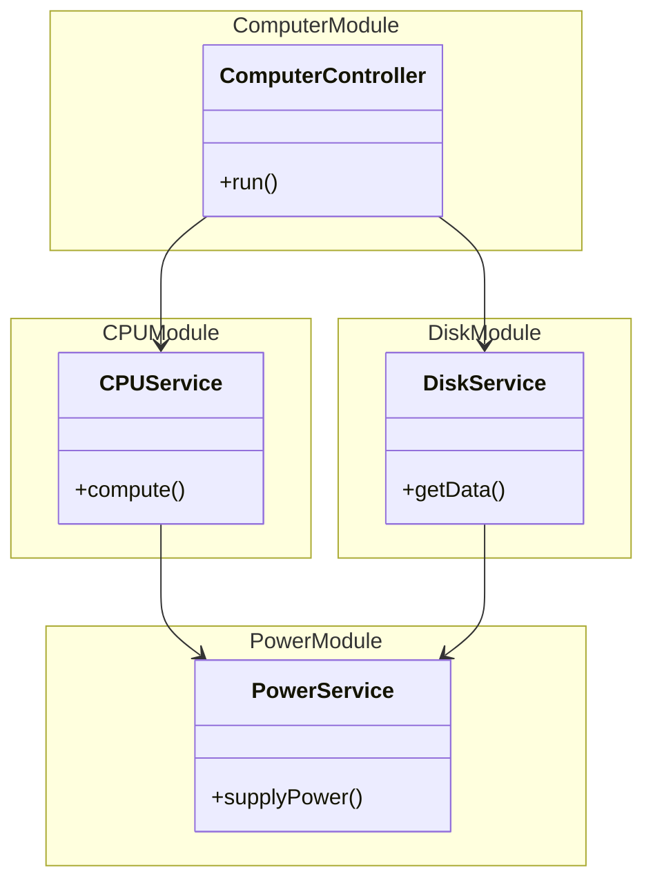

# DI small project


## cli 명령어 입력
```
nest g module computer
nest g controller computer

nest g module cpu
nest g service cpu

nest g module disk
nest g service disk

nest g module power
nest g service power
```